# 🎊 Wedding Platform - Visual Showcase

> A comprehensive look at the Wedding Platform admin panels and features built with Laravel 12 + Filament 4.

---

## 📸 Screenshots

### Authentication

#### Login Page
Clean, modern login interface with dark theme support.

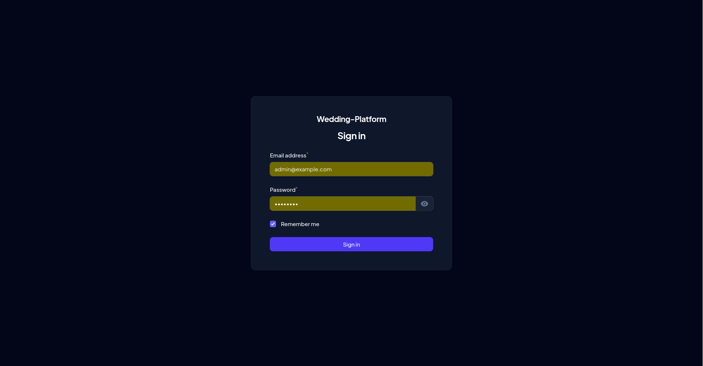

---

### Super Admin Dashboard

#### Dark Theme
The main dashboard provides at-a-glance metrics and quick access to all platform features.


#### Light Theme
Full light theme support for user preference.

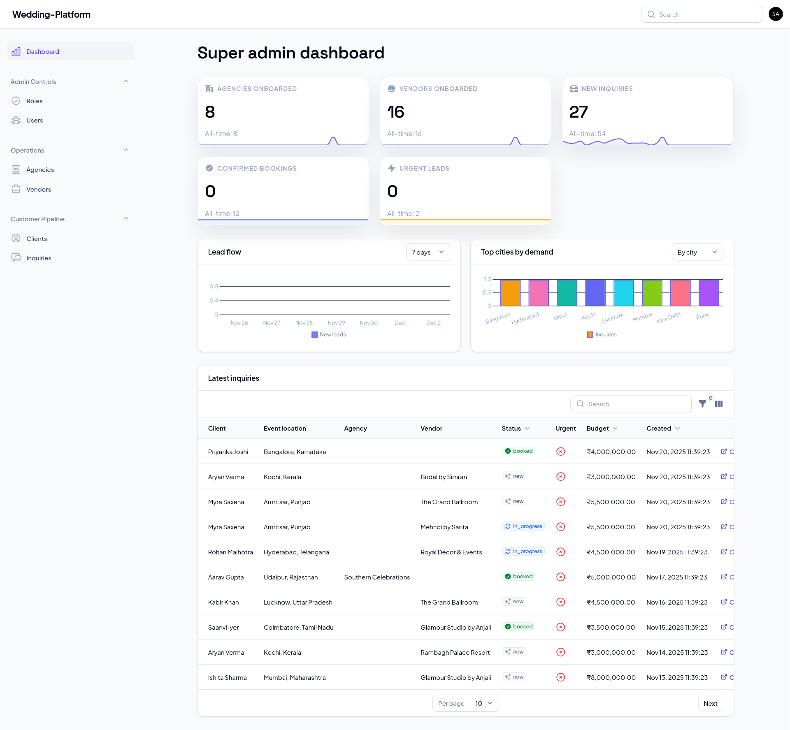

---

### User Management

#### Users List
Manage all platform users with search, filters, and bulk actions.

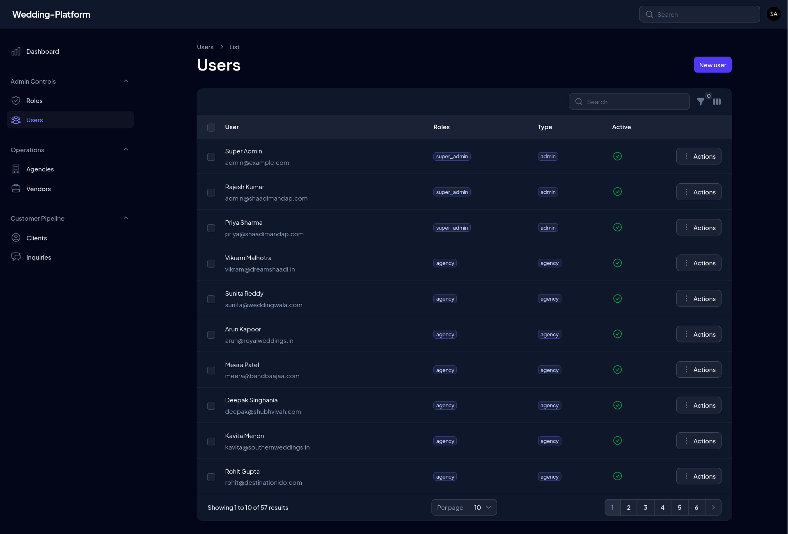

#### Roles & Permissions
Granular role-based access control powered by Filament Shield.

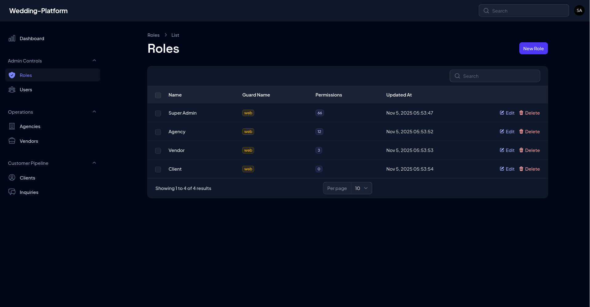

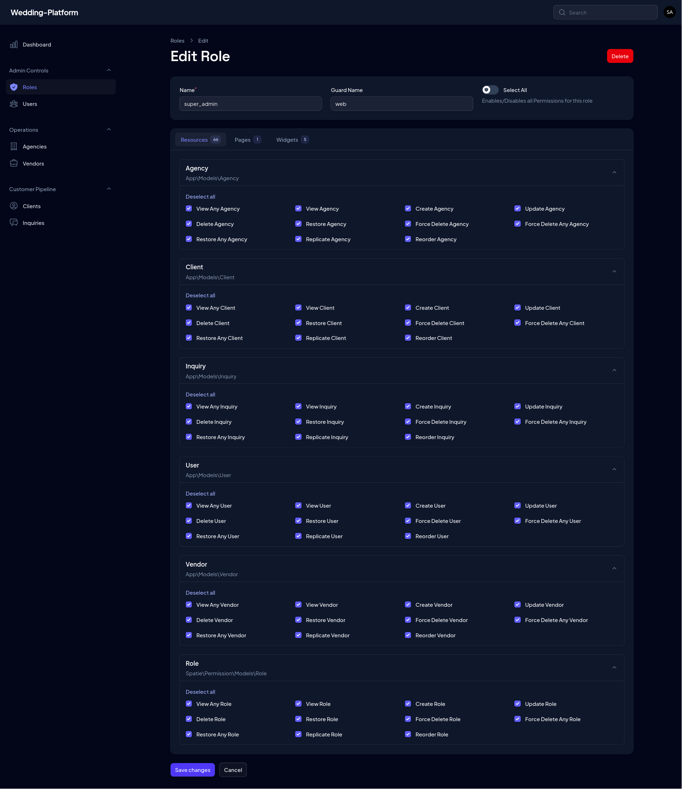

---

### Agency Management

#### Agencies List
View and manage all wedding agencies with status indicators and quick actions.

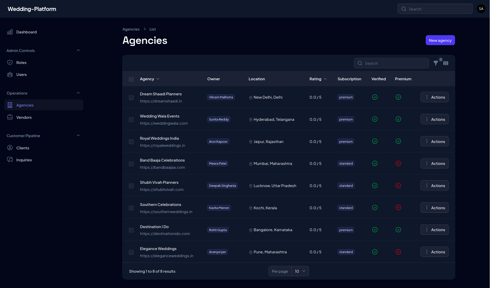

#### Edit Agency
Comprehensive agency profile editor with media uploads, vendor associations, and more.

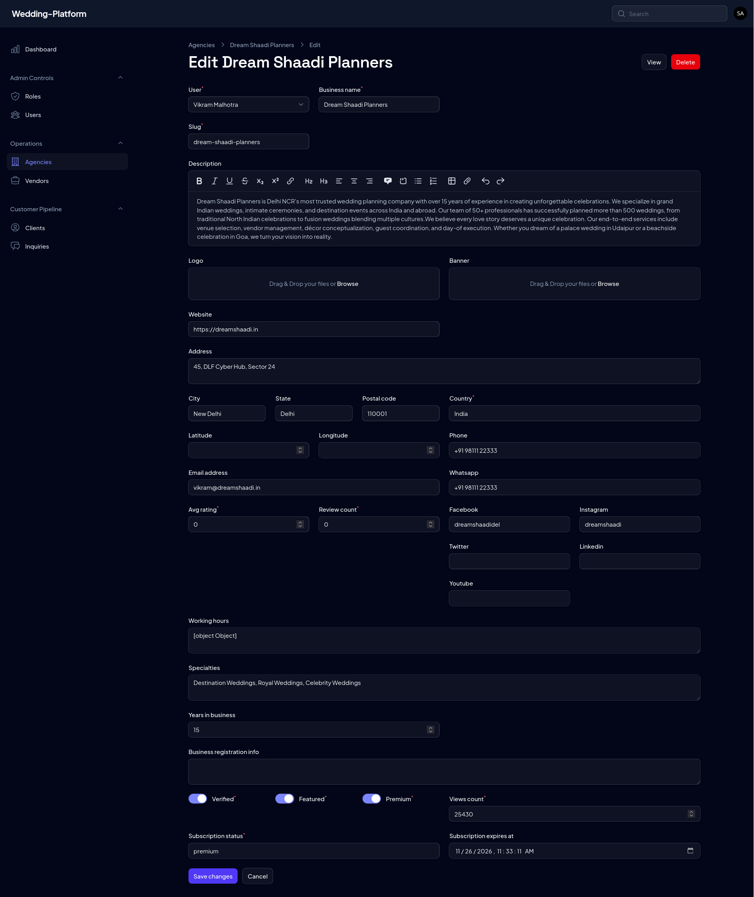

---

### Vendor Management

#### Vendors List
Browse vendors with category filters, pricing info, and availability status.

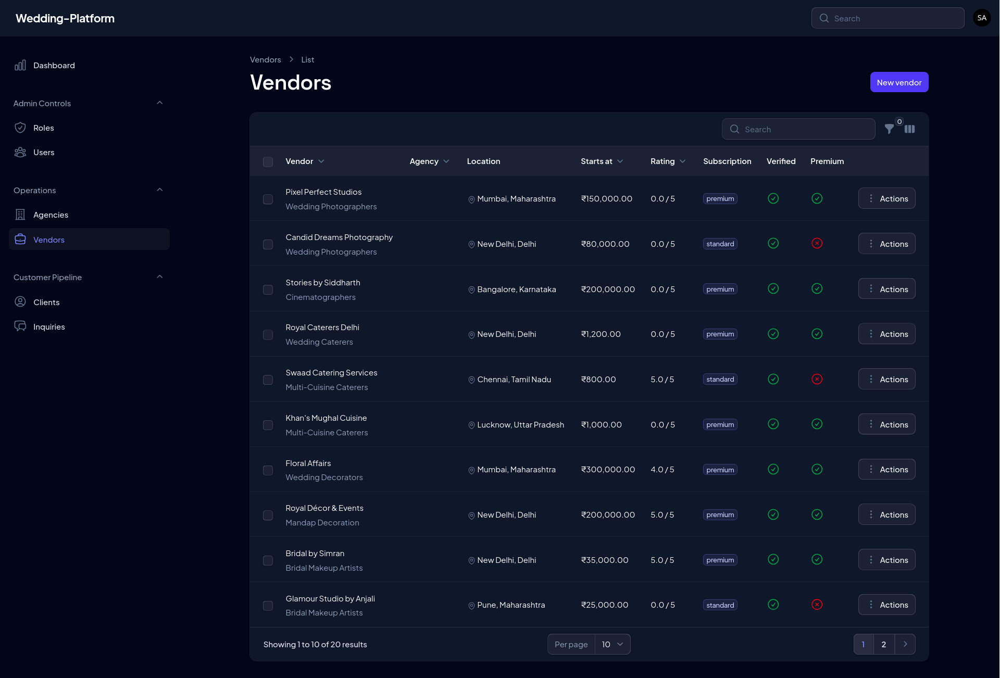

#### Edit Vendor
Full vendor profile management including services, pricing, availability calendar, and portfolio.


---

### Client & Inquiry Management

#### Clients List
Track all platform clients and their inquiry history.

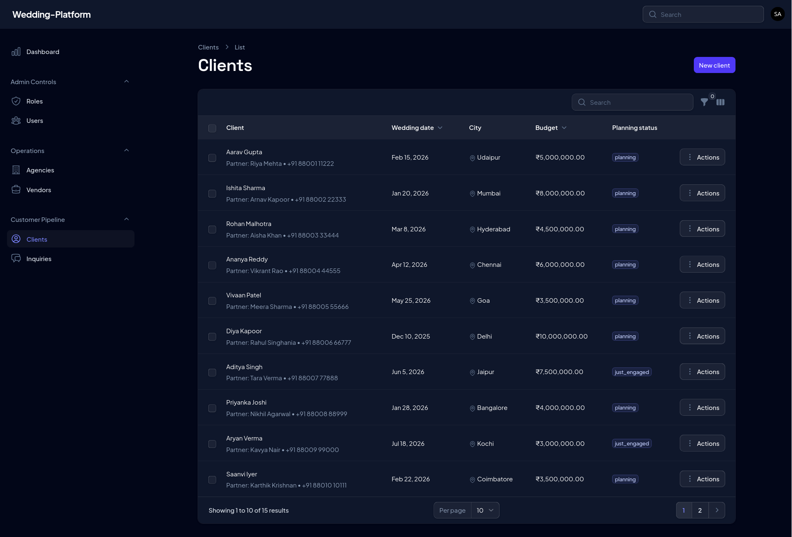

#### Edit Client
Manage client details and view their associated inquiries.

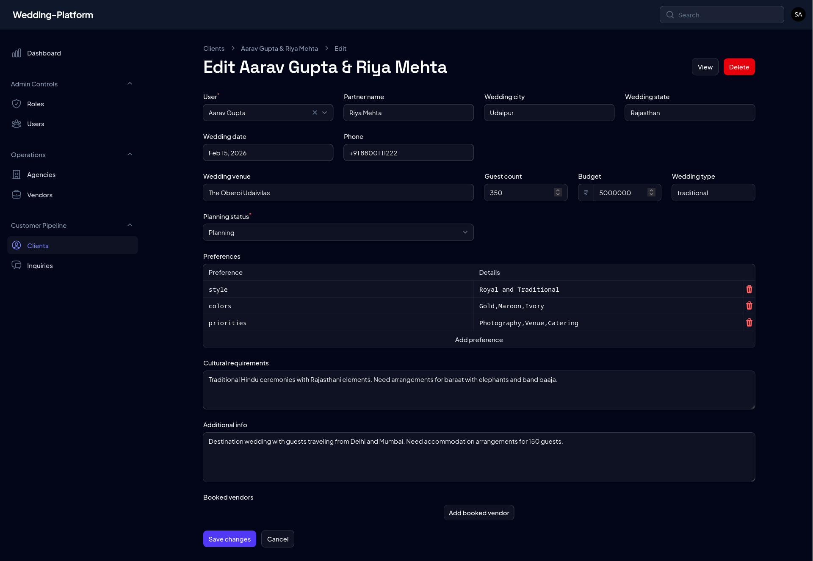

#### Inquiries List
Monitor all inquiries with status tracking, urgency flags, and response times.

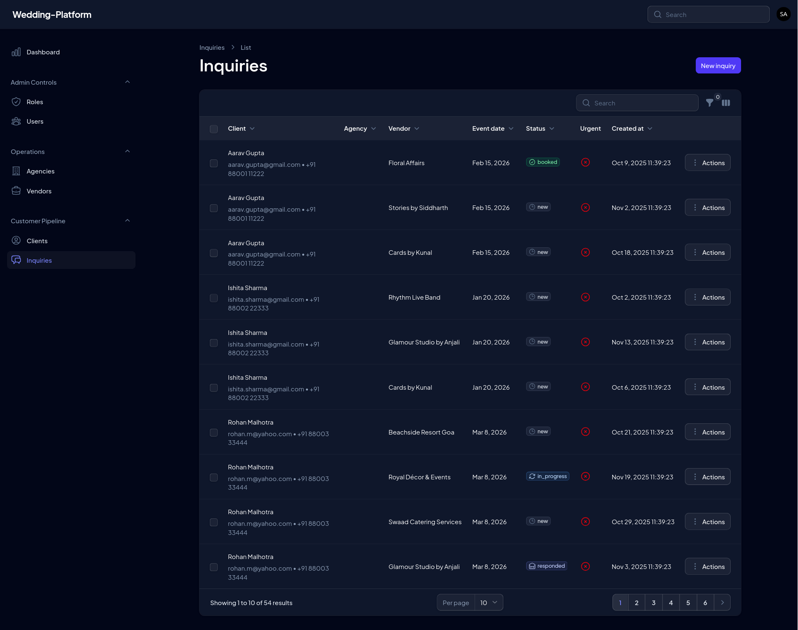

#### Edit Inquiry
Full inquiry workflow management with notes, messages, and status transitions.

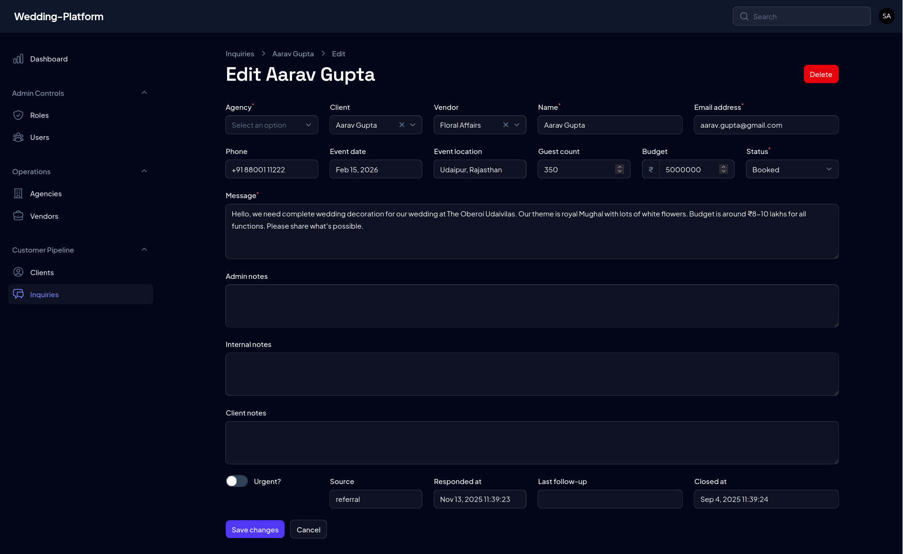

---

## ✨ Key Features

### 🔐 Multi-Panel Authentication
- **Admin Panel** (`/admin`) - Full platform control
- **Agency Panel** (`/agency`) - Agency-specific dashboard
- **Vendor Panel** (`/vendor`) - Vendor self-service portal

### 🗑️ Soft Delete with Safety Rails
- All models support soft deletion for data recovery
- Dependency-aware delete protection (can't delete users with active relationships)
- Force delete requires explicit confirmation with clear warning messages
- Trashed records filter to view and restore deleted items

### 🔍 Global Search
- Instant search across all resources from any panel
- Search users, agencies, vendors, clients, and inquiries
- Keyboard shortcut support (Cmd/Ctrl + K)

### 🌐 Local to Public Tunnel
Easily share your local development environment for demos and testing:

```bash
# Start sharing (get URL from `sail share` output)
./switch-env.sh share http://your-tunnel-url.laravel-sail.site:8080

# Switch back to local development
./switch-env.sh local
```

### 🎨 Theme Support
- Dark and light theme support
- Consistent design language across all panels
- Responsive design for mobile and tablet

### 📊 Dashboard Widgets
- Real-time metrics and KPIs
- Inquiry trends and conversion rates
- Vendor and agency statistics

### 🖼️ Media Management
- Spatie Media Library integration
- Logo, banner, and gallery collections
- Automatic image optimization (ready for conversions)

### 🔒 Role-Based Access Control
- Filament Shield integration
- Granular permissions per resource and action
- Custom policies for complex authorization logic

---

## 🛠️ Tech Stack

| Technology | Purpose |
|------------|---------|
| **Laravel 12** | PHP framework with modern features |
| **Filament 4** | Admin panel framework |
| **PostgreSQL** | Primary database |
| **Redis** | Caching and queues |
| **Laravel Sail** | Docker development environment |
| **Spatie Media Library** | File uploads and media management |
| **Filament Shield** | Role and permission management |

---

## 🚀 Getting Started

See the main [README.md](README.md) for installation and setup instructions.

---

<p align="center">
  Built with ❤️ using Laravel & Filament
</p>
